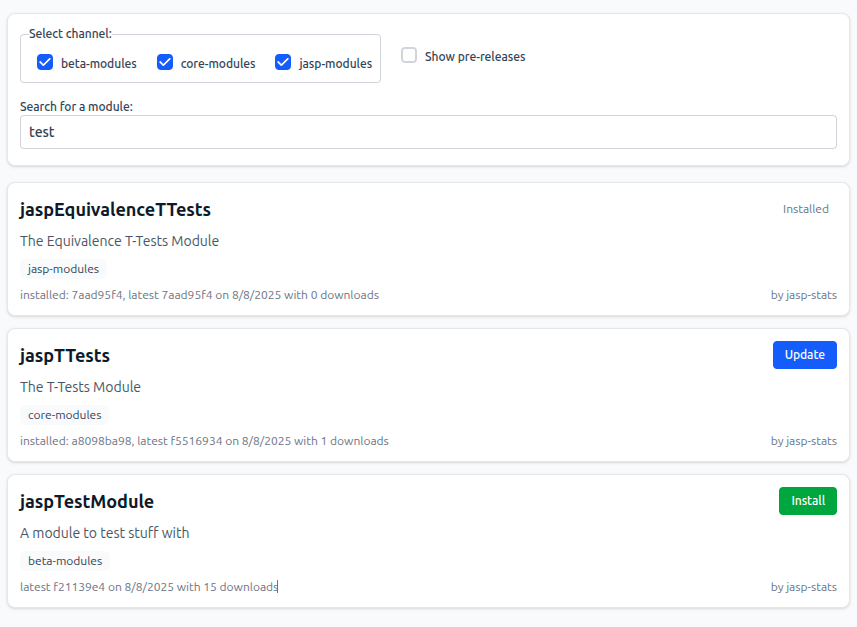

Welcome to JASP stats modules web app!

[](https://opensource.org/licenses/Apache-2.0)
[](https://biomejs.dev)
[](https://github.com/jasp-stats-modules/modules-app/actions/workflows/deploy.yml)
[](https://github.com/jasp-stats-modules/modules-app/actions/workflows/quality.yml)
[](https://fairsoftwarechecklist.net/v0.2?f=31&a=32113&i=22300&r=113)
[](https://research-software-directory.org/software/jasp-modules-app)


A web application hosted at https://module-library.jasp-stats.org/ that allows you to search/filter all the available JASP modules and install them.

[](screenshot.png)

# Usage

## Search parameters

The web application is designed to be opened from inside JASP desktop application, but it can also be used as a standalone web application.

The JASP desktop application can tell the web application which version/architecture it is and which modules are installed by using search parameters (`?key=val`) in the URL.

- v: the version of the JASP desktop application for example `0.95.0`
- a: the architecture of the JASP desktop application for example `Windows_x86-64`
- i: installed modules. A JSON object with the module names as keys and their versions as values. The object has to be [URL encoded](https://developer.mozilla.org/en-US/docs/Web/JavaScript/Reference/Global_Objects/encodeURIComponent). For example, `{"22jaspEquivalenceTTests":"0.95.0","22jaspTTests":"0.94.0"}` becomes `%7B%2222jaspEquivalenceTTests%22%3A%220.95.0%22%2C%2222jaspTTests%22%3A%220.94.0%22%7D`.
- p: show pre-releases initially. Use `1` to show pre-releases and use `0` to hide them initially.
- c: URL for the catalog aka index.json. 
   When not set uses `index.json` (`public/index.json` in local development or on deployed site uses `https://jasp-stats-modules.github.io/modules-app/index.json`).
   If URL is not a relative path aka other server then make sure correct [CORS headers](https://developer.mozilla.org/en-US/docs/Web/HTTP/Guides/CORS) are returned on server that hosts index.json.
- t: Theme. Use `dark` for dark theme, `light` for light theme, and `system` to match system theme (default).

A full URL could look like [https://jasp-stats-modules.github.io/modules-app/?a=Windows_x86-64&v=0.95.0&i=%7B%22jaspEquivalenceTTests%22%3A%220.95.0%22%2C%22jaspTTests%22%3A%220.94.0%22%7D&p=0](https://jasp-stats-modules.github.io/modules-app/?a=Windows_x86-64&v=0.95.0&i=%7B%22jaspEquivalenceTTests%22%3A%220.95.0%22%2C%22jaspTTests%22%3A%220.94.0%22%7D&p=0).

## Update list of modules

The list of modules can be updated by running the GitHub workflow at https://github.com/jasp-stats-modules/modules-app/actions/workflows/deploy.yml .
Use the "Run workflow" button to trigger the workflow manually.

# Architecture

The web application is a single page application (SPA) with the following characteristics:

- Built with [React](https://reactjs.org/) and [TypeScript](https://www.typescriptlang.org/)
- Uses [Vite](https://vitejs.dev/) as the build tool
- Uses [pnpm](https://pnpm.io/) as the package manager
- Uses [Tailwind CSS](https://tailwindcss.com/) for styling
- Uses [TanStack Router](https://tanstack.com/router) for routing, with an initial file-based router setup in `src/routes`
- Uses [biome](https://biomejs.dev/) for linting and formatting
- Fetches data from the [GitHub GraphQL API](https://docs.github.com/en/graphql) to get available JASP modules and their release assets

To get a list of available JASP modules, it does the following with the help of the `src/scrape.ts` script:

1. Fetches the git submodules of the https://github.com/jasp-stats-modules/modules-registry repository.
   - the directory in which a submodule is located is the channel
2. For each submodule fetches its releases
   1. Fetches the release data, paged per 100 repositories using GitHub GraphQL API
   2. Filter the release assets ending with `.JASPModule` extension
   3. Looks in release description for the JASP version range the module is compatible with. The [version range](https://semver.npmjs.com/) is specified in front matter header as for example:
      ```markdown
      ---
      jasp: '>=0.95.0'
      ---
      ```
   4. Split releases into latest release for each JASP version range and latest pre release.
3. Saves data in `src/index.json` for the web application to use

# Getting Started

To run this application:

```bash
pnpm install
# Scrape a list of JASP module and their release assets from GitHub and save as src/index.json
export GITHUB_TOKEN=<your personal fine grained access token, only access to public repositories is needed and no other permissions>
pnpm scrape
pnpm start  
```

Application will be running at http://localhost:3000 (unless stated otherwise).

# Building For Production

To build run:

```bash
pnpm scrape
pnpm build
```

## Testing

We use [Vitest](https://vitest.dev/) for testing. You can run the tests with:

```bash
pnpm test
```

## Linting and Formatting

Can be typechecked with:

```bash
pnpm typecheck
```

Can be formatted and linted with:

```bash
pnpm check
```

## Contributing

Contributions are welcome! Please read the [contributing guidelines](CONTRIBUTING.md) for more information.
